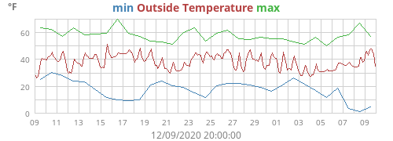

# XAggs
This extension adds some useful aggregation types to WeeWX, using the XTypes facility. 
 - Historical highs and lows for a date;
 - The number of days above or below an average value. 
 
Works for both SQLite and MySQL.

## Prerequisite
XAggs will only work with WeeWX V4.2 or later. 

## Installation instructions

1. Download and install the extension

    ```shell
    cd /home/weewx
    wget https://github.com/tkeffer/weewx-xaggs/archive/master.zip
    wee_extension --install=weewx-xaggs.zip
    ```
2. Restart WeeWX. For example:

   ```shell
   sudo systemctl stop weewx
   sudo systemctl start weewx
   ```

## Using
After installation, these new aggregation types will be available:

| *Name*                | *Description*                                    |
|:----------------------|:-------------------------------------------------|
| `historical_min`      | The lowest temperature seen on this day.         |
| `historical_min_avg`  | The average lowest temperature seen on this day. |
| `historical_max`      | The highest temperature seen on this day.        |
| `historical_max_avg`  | The average highest temperature seen on this day.|
| `historical_mintime`  | The time of the lowest temperature.              |
| `historical_maxtime`  | The time of the highest temperature.             |
| `historical_avg`      | The average temperature seen on this day.        |
| `avg_ge(val)`         | The number of days with average >= `val`.        |
| `avg_gt(val)`         | The number of days with average > `val`.         |
| `avg_le(val)`         | The number of days with average <= `val`.        |
| `avg_lt(val)`         | The number of days with average < `val`.         |

### Tags
For example, the following template

    <p>Historically high temperature for this day: 
        $day.outTemp.historical_max in $day.outTemp.historical_maxtime.format("%Y")</p>
    <p>Number of days this month with average temperature over 20&deg;C:
        $month.outTemp.avg_gt((20.0, 'degree_C', 'group_temperature'))</p> 
    
would result in something like:

>Historically high temperature for this day: 64.8°F in 2013<br/>
Number of days this month with average temperature over 20°C: 11

### Plots

Plots can also be made, which show historical highs and lows. For example, putting this plot
specification under the `[[monthimages]]` section of `skin.conf`.

```ini
    [[monthimages]]

        ...

        [[[monthhistorical]]]
             [[[[min]]]]
                 label = min
                 aggregate_type = historical_min
                 aggregate_interval = day
                 data_type = outTemp
             [[[[outTemp]]]]
             [[[[max]]]]
                label = max
                aggregate_type = historical_max
                aggregate_interval = day
                data_type = outTemp
```
will result in a plot that looks something like this:



## Limitations
The only supported aggregation interval is one day. This means the `historical_` aggregations can
*only* be used with the `$day` tag, or in plots with an aggregation interval of one day. 

